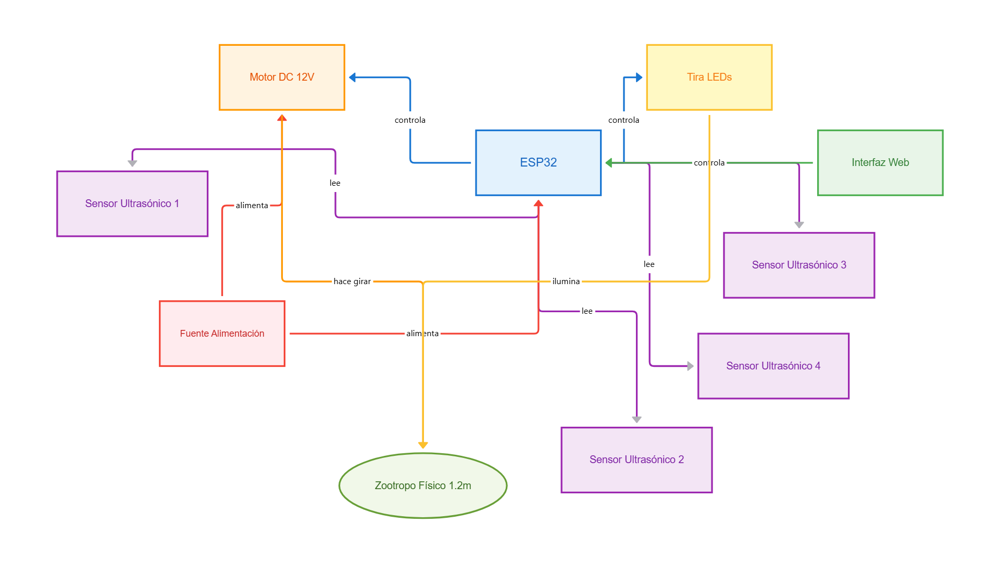

# Zoótropo Interactivo

## Proyecto dentro de la exposición "Antropocósmico"

## 📜 Introducción

Este documento detalla el proyecto **Zootropo Interactivo**, una pieza central de la exposición **"Antropocósmico"**. Esta exposición, presentada por el Tecnológico de Monterrey, Campus Puebla, en colaboración con el MUI (Museo Urbano Interactivo), explora la profunda **conexión entre el ser humano y el cosmos** en [Noviembre 2024](https://www.facebook.com/story.php?story_fbid=1110486777747822&id=100063595313118).

El Zoótropo Interactivo fue desarrollado como una instalación de arte dinámico que materializa este concepto. El proyecto consiste en un zootropo de 1.2 metros de diámetro con 12 figuras animadas que, a través de la ilusión del movimiento, invitan a la reflexión sobre nuestro lugar en el universo y la naturaleza cíclica de la existencia. La instalación es interactiva, reaccionando a la presencia del público para crear un diálogo entre el espectador, la obra y el tema cósmico.

---

## 🎥 Video de Demostración

Para una demostración visual del proyecto en funcionamiento, puedes ver el siguiente video:

[Zootropo Interactivo - Demostración en YouTube](https://www.youtube.com/watch?v=OpLJevnYXOU)

---

## 📄 Descripción del Proyecto y Contexto Artístico

Dentro del marco de "Antropocósmico", el **Zootropo Interactivo** sirve como una metáfora visual del movimiento perpetuo y la vida. Es una reinterpretación moderna del clásico juguete óptico, escalado a una obra de arte que combina tecnología, ingeniería y diseño para ofrecer una experiencia inmersiva.

El sistema está controlado por un microcontrolador ESP32 que gestiona un motor, un sistema de iluminación LED para el efecto estroboscópico y sensores ultrasónicos. Esta tecnología permite que la obra "sienta" la presencia del espectador, activando la animación y creando un vínculo directo y personal. La velocidad de la animación se puede controlar a través de una interfaz web, permitiendo al público alterar el ritmo del "universo" de la obra.

---

## ✨ Características Principales

- **Gran Escala:** Zootropo de 1.2 metros de diámetro.
- **Animación 3D:** 12 figuras impresas en 3D que crean una animación fluida.
- **Interactivo:** Cuatro sensores ultrasónicos de proximidad que detectan la presencia de personas para activar la obra.
- **Control Web:** Interfaz web para controlar la velocidad del motor.
- **Seguridad:** El sistema se detiene automáticamente si una persona se acerca a menos de 30 cm.
- **Efecto Estroboscópico:** Utiliza una tira de LEDs para iluminar las figuras en el momento preciso y crear la ilusión de movimiento.

---

## 🛠️ Tecnologías y Componentes

### Hardware

- **Microcontrolador:** ESP32
- **Motor:** Motor de corriente continua de 12V
- **Sensores:** 4 sensores ultrasónicos de proximidad
- **Iluminación:** Tira de LEDs para el efecto estroboscópico
- **Fuente de Alimentación:** Fuente de alimentación para el motor y la electrónica

### Software y Lenguajes de Programación

- **Firmware:** C/C++ para el ESP32
- **Control:** Interfaz web para el control de velocidad

---

## 🏗️ Diagrama de Arquitectura del Sistema



---

## 📁 Estructura del Proyecto

El repositorio en GitHub está organizado de la siguiente manera:

```

Zootropo/
├── CAD/              \# Archivos de diseño asistido por computadora (DXF, STL)
├── Documentación/    \# Manuales de usuario y otros documentos
├── Electrónica/      \# Esquemas y archivos PCB
├── Firmware/         \# Código fuente para el ESP32
└── README.md         \# Información general del proyecto

```

- **CAD:** Contiene los archivos de diseño para las piezas del zootropo, incluyendo las figuras animadas y la estructura principal.
- **Documentación:** Incluye manuales y otros documentos relevantes.
- **Electrónica:** Archivos del diseño electrónico, como el esquemático y el diseño de la placa de circuito impreso (PCB).
- **Firmware:** El código que se ejecuta en el ESP32 para controlar todos los componentes del zootropo.

---

## ⚙️ Instalación y Puesta en Marcha

Para replicar este proyecto, necesitarías seguir los siguientes pasos generales:

1.  **Fabricación de Piezas:** Utiliza los archivos de la carpeta `CAD/` para imprimir en 3D las figuras y cortar la estructura del zootropo.
2.  **Montaje del Circuito:** Monta el circuito electrónico basándote en los archivos de la carpeta `Electrónica/`.
3.  **Carga del Firmware:** Compila y carga el firmware de la carpeta `Firmware/` en el microcontrolador ESP32.
4.  **Ensamblaje Final:** Ensambla todas las piezas mecánicas y electrónicas para completar el zootropo.
5.  **Conexión a la Red:** Conecta el ESP32 a una red Wi-Fi para poder acceder a la interfaz web de control.

---

## 🚀 Uso

Una vez que el zootropo está ensamblado y en funcionamiento:

1.  **Interacción por Proximidad:** Acércate al zootropo para que los sensores de proximidad lo detecten y se active la animación.
2.  **Control de Velocidad:** Accede a la interfaz web desde un dispositivo conectado a la misma red Wi-Fi que el ESP32 para ajustar la velocidad de rotación y, por lo tanto, la velocidad de la animación.
3.  **Seguridad:** Ten en cuenta que el zootropo se detendrá si te acercas demasiado (menos de 30 cm) para evitar accidentes.

---

## 💡 Esquemas, PCB y Archivos CAD

- Los archivos de diseño electrónico, incluyendo el esquemático del circuito y el diseño de la PCB, se encuentran en la carpeta `Electrónica/`.
- Los modelos 3D para las figuras animadas y las piezas estructurales están disponibles en la carpeta `CAD/`.

---

## 👨‍💻 Autor

- **José Ángel Balbuena Palma** - [Perfil de GitHub](https://github.com/JoseBalbuena181096)
